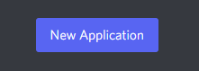
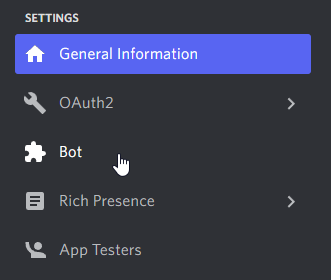
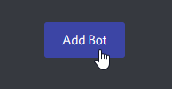
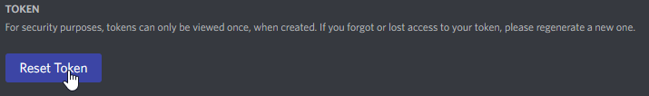
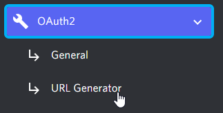
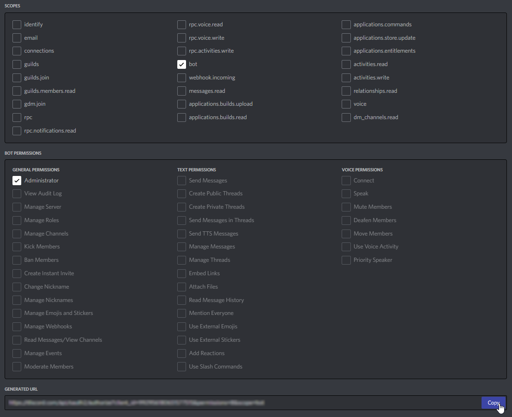
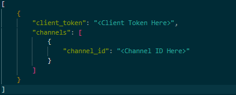
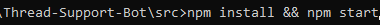

    

    <b>Easily find textbooks and other educational resources with this Discord bot.</b>

    Written using Javascript, Node.js, and Discord.js.

 

    
    

    

 

## How To Use:

1. **Visit <https://discord.com/developers/applications> and make an Application.**

2. **Add a Bot to your Application.**

3. **Reset the Client Token for the Bot and store it somewhere safe for now.**

4. **Navigate to the OAuth URL page.**

5. **Generate a URL for your Bot giving it Administration priveleges, and visit the URL in order to add it to your Discord Server.**

6. **Paste the Client Token you copied in step 3 into the server_data.json file in the /src/config/ directory and fill in the other fields.**

7. **Within the /src/ directory, open a terminal and type `npm install` to install the Bot's dependencies, then type `npm start` to start the Bot.**

